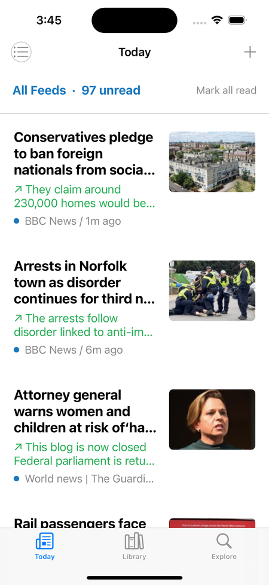

# RSSReader

**An RSS and Atom reader for iOS, written in UIKit with no third-party
dependencies.** Subscribe to feeds, group them into categories, and read one
merged timeline, newest first.

<br clear="left">



## What it does

- **Reads RSS and Atom.** One `XMLParser` delegate handles both, pulls a
  thumbnail out of whichever element the feed happened to use — `enclosure`,
  `media:content`, `itunes:image`, or the first `` in the summary — and
  strips HTML out of the text.
- **Groups feeds into categories.** Read everything at once, one category, or a
  single feed. Feeds can be renamed, moved between categories, and deleted.
- **Tracks what you have read.** Unread articles carry a dot and full-strength
  text; opening one marks it read, swiping toggles it, and the header shows a
  live unread count.
- **Works offline.** The last 50 articles per feed are cached on disk, with
  thumbnails cached in memory and on disk, downsampled before they are stored.
- **Ships a feed directory.** The Explore tab lists ready-made feeds — BBC, The
  Guardian, Apple, MIT, NASA, Smithsonian and others — to subscribe to in one
  tap, so there is something to read before you have typed a single URL.
- **Sorts dates that other readers give up on.** RSS publishes RFC 822
  timestamps, Atom publishes ISO 8601, and real feeds drift from both; the
  parser tries a list of formats rather than one.

Articles open in a Safari view controller. Pull down to refresh.

<br clear="right">

## Building it

Requires Xcode 13 or later and iOS 15.0 or later.

The simulator needs no setup: open `RSSReader.xcodeproj`, pick a simulator, run.

To run on a real device, supply your own signing Team ID once:

```sh
cp Config/Signing.local.xcconfig.example Config/Signing.local.xcconfig
```

then set `LOCAL_DEVELOPMENT_TEAM` in that copy. It is gitignored, so no Team ID
is ever committed — `project.pbxproj` contains none.

## How it is put together

No storyboard-heavy architecture and no dependency manager; views are built in
code, and everything is `URLSession`, `XMLParser`, and `UIKit`.

| File | Responsibility |
| --- | --- |
| `XML.Parser.swift` | Models (`RSSItem`, `FeedSubscription`, `FeedCategory`, `FeedSelection`), the `XMLParser` delegate that reads both RSS and Atom, and publish-date parsing |
| `FeedStore.swift` | All persistence: the library, the article cache, and read state |
| `ViewController.swift` | The Today list, `RssCell`, thumbnail loading, refresh orchestration |
| `SidebarViewController.swift`, `SidebarContainerViewController.swift` | Feed selection panel and its slide-in presentation |
| `SubscriptionManagerViewController.swift` | Library editing |
| `ExploreViewController.swift` | Built-in feed directory |

Storage is deliberately split by what it would cost to lose:

| What | Where |
| --- | --- |
| Categories and subscriptions | `UserDefaults`, key `feedCategories` |
| Cached articles, 50 per feed | `Library/Caches/RSSReaderFeedCache.json` |
| Read article identifiers | `Library/Application Support/RSSReaderReadArticles.json` |
| Article thumbnails | `Library/Caches/RSSReaderThumbnails/` |

Losing the caches costs a re-download; losing reading history cannot be undone,
so it lives where iOS will not purge it. `DECISIONS.md` records the reasoning
behind this and the other choices.

## App icon

The icon is drawn in code rather than painted, so it can be adjusted without a
design tool:

```sh
python3 -m pip install Pillow      # once
python3 Tools/make_app_icon.py
```

That rewrites `AppIcon.png` in the asset catalog at 1024×1024 with no alpha
channel; Xcode derives every smaller size from it.

## Status

A personal project, actively worked on and not published to the App Store. It
does what the list above says and no more — `roadmap.md` tracks the known gaps,
including an unread-only filter, real tabs, background refresh, and search.
